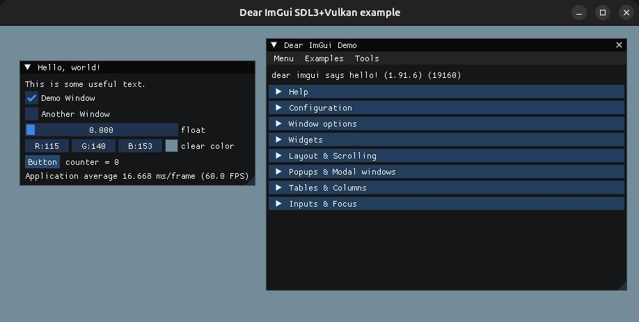

# attempt-imgui-ubuntu

Trying to use Imgui on Ubuntu

Platform: Ubuntu 24.04.1 LTS

Dear ImGui (MIT) https://github.com/ocornut/imgui  
using v1.91.6

Added CMakeLists.txt files to build glfw and sdl2 examples with system libraries, and to build sdl3 example with additional SDL3 includes and libraries.

Build:

in example folder

mkdir build  
cd build  
cmake ..  
make

The SDL3 example requires additional include and library files to build.  
Using SDL-preview-3.1.6.tar.gz from https://github.com/libsdl-org/SDL (Zlib license)

Build SDL3 and copy include files to example_sdl3_vulkan include directory, builded libraries to lib directory.

The directory structure should be like this:

```
   example_sdl3_vulkan/
   ├── include/
   │   └── SDL3
   └── lib/
       ├── libSDL3.so
       ├── libSDL3.so.0
       └── libSDL3.so.0.1.6
```


